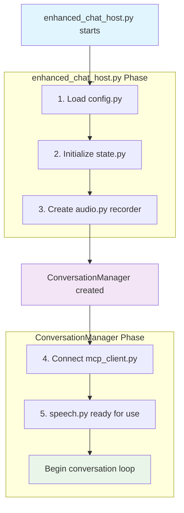

# ChatOS - Voice-Driven Operating System Assistant

## Overview

ChatOS is an intelligent voice-driven assistant that combines local AI models with cloud fallbacks to provide a seamless interaction experience. The system uses Model Context Protocol (MCP) to enable the AI to interact with your operating system, launch applications, manage files, and perform various system tasks through natural language commands.

## System Architecture

### Core Components

**Host Application** (`host/` directory)
- Voice recognition and speech processing
- Local-first AI model integration with cloud fallback
- Conversation management and state handling
- Audio recording and text-to-speech

**MCP Server** (`mcp_os/` directory)
- Tool execution engine
- Application launcher with OS-specific configurations
- File system operations
- Steam integration for gaming

### Key Features

- **Local-First AI**: Prioritizes local Ollama models for speed and privacy
- **Intelligent Fallback**: Automatically switches to OpenAI models when needed
- **Voice Interface**: Continuous listening with wake phrase detection
- **Cross-Platform**: Supports Windows, macOS, and Linux
- **Tool Integration**: Extensive application launching and system control
- **Sleep Mode**: Energy-efficient operation with wake commands

## Installation and Setup

### Prerequisites

- Python 3.8 or higher
- Two separate virtual environments (host and server)
- Ollama installed for local AI models
- OpenAI API key for fallback functionality

### Virtual Environment Setup

```bash
# Create server environment
python -m venv .venv-server
.venv-server\Scripts\activate  # Windows
source .venv-server/bin/activate  # Linux/macOS

# Install server dependencies
pip install fastmcp

# Create host environment  
python -m venv .venv-host
.venv-host\Scripts\activate  # Windows
source .venv-host/bin/activate  # Linux/macOS

# Install host dependencies
pip install openai python-dotenv webrtcvad pyaudio pyttsx3
```

### Environment Configuration

Create a `.env` file in the project root:

```env
# OpenAI Configuration
OPENAI_API_KEY=your_openai_api_key_here

# Model Configuration
USE_LOCAL_FIRST=true
LOCAL_CHAT_MODEL=llama3.1:8b-instruct-q4_0
FRONTIER_CHAT_MODEL=gpt-4o
OLLAMA_HOST=http://localhost:11434

# Audio Configuration
SAMPLE_RATE=16000
SILENCE_DURATION=1.5
PROCESSING_TIMEOUT=60.0

# Wake Phrase Configuration
STUCK_PHRASE="hello abraxas are you stuck"

# Mode Selection
CHATOS_CLI_MODE=false  # Set to true for CLI mode
```

## Launch System

### Windows Launch Script

The system uses a batch file (`run.bat`) to coordinate the startup:

```batch
@echo off
:: ────────────────────────────────────────────────
:: ChatOS launch script – Windows 10 / 11
:: place this file in ...\ChatOS\start_chat_os.bat
:: ────────────────────────────────────────────────

REM ── 1.  Define absolute paths (edit if you moved folders) ──────────────
set "CHATOS_DIR=%~dp0"
set "SERVER_VENV=%CHATOS_DIR%.venv-server"
set "HOST_VENV=%CHATOS_DIR%.venv-host"

REM ── 2.  Launch the MCP server in a new window ─────────────────────────
start "ChatOS-Server" ^
cmd /k ^
"^
    cd /d "%CHATOS_DIR%" ^& ^
    call "%SERVER_VENV%\Scripts\activate.bat" ^& ^
    python mcp_os\server.py ^
"

REM Wait for server to be ready
timeout /t 3 /nobreak > nul

REM ── 3.  Activate the host venv in *this* window and run the UI ────────
call "%HOST_VENV%\Scripts\activate.bat"
python host\enhanced_chat_host.py

REM ── 4.  Keep the window open after exit so you can read logs ──────────
echo.
echo Chat host has terminated.  Press any key to close this window.
pause > nul
```

### Launch Process

1. **Server Startup**: Launches MCP server in separate console window
2. **Initialization Delay**: 3-second wait for server readiness
3. **Host Activation**: Starts the main ChatOS interface
4. **Logging**: Keeps console open for debugging after exit

## Operating Modes

### Voice Mode (Default)

**Activation**: `CHATOS_CLI_MODE=false`

Features:
- Continuous audio monitoring
- Wake phrase detection when stuck
- Text-to-speech responses
- Sleep/wake functionality
- Automatic transcription and processing

**Voice Commands**:
- `"go to sleep"` - Enter sleep mode
- `"wake up"` / `"hello"` - Wake from sleep
- `"reset chat"` - Clear conversation history
- `"exit"` / `"quit"` - Shutdown system

### CLI Mode

**Activation**: `CHATOS_CLI_MODE=true`

Features:
- Text-based interaction
- Same tool capabilities as voice mode
- Faster development and debugging
- No audio processing overhead

**CLI Commands**:
- `exit`, `quit`, `goodbye` - Quit application
- `reset`, `clear`, `new chat` - Start new conversation
- `help` - Show available commands

## AI Model Configuration

### Local-First Architecture

**Primary Model**: Ollama-hosted local models
- Default: `llama3.1:8b-instruct-q4_0`
- Faster response times
- No API costs
- Privacy-focused

**Fallback Model**: OpenAI GPT models
- Default: `gpt-4o`
- Handles complex tool calling
- Automatic failover on local model issues
- Enhanced reasoning capabilities

### Failover Logic

```python
class FailoverChatProvider:
    def __init__(self, primary, backup, timeout=30):
        self.primary = primary      # Local Ollama model
        self.backup = backup        # OpenAI model
        self.timeout = timeout      # Local model timeout
```

**Failover Triggers**:
- Local model timeout
- Tool execution failures
- Network connectivity issues
- Model unavailability

## Tool System (MCP Integration)

### Application Launcher

The system can launch applications using natural language through the `mcp_os/apps_config.json` configuration file. This file provides comprehensive cross-platform application mapping with intelligent alias resolution.

**Examples**:
- `"Open notepad"` → Launches Notepad
- `"Launch Word"` / `"Open document editor"` → Opens Microsoft Word
- `"Start calculator"` / `"Open math"` → Starts Calculator app
- `"Launch browser"` / `"Open internet"` → Opens default browser

## Application Configuration (`apps_config.json`)

### File Structure

The configuration file has two main sections:

#### 1. **Aliases Section**
Maps natural language terms to primary application names:

```json
{
  "aliases": {
    "windows": {
      "notepad": ["notepad", "notes", "note", "text editor", "texteditor"],
      "calculator": ["calc", "calculator", "calculations", "math"],
      "chrome": ["chrome", "google chrome", "browser", "web browser", "internet"],
      "word": ["word", "microsoft word", "winword", "document", "docs"]
    }
  }
}
```

**Benefits**:
- **Natural Language**: Users can say "open browser" instead of memorizing "chrome"
- **Multiple Variations**: Supports different ways of referring to the same app
- **User-Friendly**: More intuitive voice commands

#### 2. **Executable Paths Section**
Maps application names to actual executable paths with fallback options:

```json
{
  "windows": {
    "word": [
      "C:\\Program Files\\Microsoft Office\\root\\Office16\\WINWORD.EXE",
      "winword.exe",
      "start winword"
    ],
    "chrome": [
      "chrome.exe",
      "C:\\Program Files\\Google\\Chrome\\Application\\chrome.exe",
      "C:\\Program Files (x86)\\Google\\Chrome\\Application\\chrome.exe",
      "start chrome"
    ]
  }
}
```

**Fallback Strategy**:
1. **Specific Path**: Tries exact installation path first
2. **PATH Search**: Falls back to searching system PATH
3. **Shell Command**: Uses shell commands as last resort

### Platform-Specific Configurations

#### Windows Applications
- **System Apps**: `notepad`, `calculator`, `cmd`, `powershell`, `explorer`
- **Microsoft Office**: `word`, `excel`, `powerpoint`, `outlook`
- **Browsers**: `chrome`, `firefox`, `edge`
- **Development**: `code` (VS Code)
- **System Tools**: `taskmgr`, `regedit`, `control panel`
- **Settings**: `ms-settings:` (Windows Settings app)

#### macOS Applications
- **System Apps**: `finder`, `safari`, `terminal`, `calculator`
- **Productivity**: `calendar`, `mail`, `messages`, `notes`
- **Microsoft Office**: Full application bundle paths
- **Development**: `xcode`, `code` (VS Code)
- **Third-party**: `slack`, `spotify`

#### Linux Applications
- **Desktop Environment**: `gnome-terminal`, `nautilus`, `gnome-calculator`
- **Browsers**: `firefox`, `chrome`/`chromium`
- **LibreOffice**: `libreoffice writer`, `calc`, `impress`
- **Development**: `code` (VS Code)
- **Media**: `vlc`, `gimp`
- **Communication**: `thunderbird`, `slack`, `discord`

### Special Features

#### Username Substitution
Supports `{username}` placeholder for user-specific paths:

```json
"code": [
  "C:\\Users\\{username}\\AppData\\Local\\Programs\\Microsoft VS Code\\Code.exe"
]
```

#### Protocol Handlers
Supports Windows protocol handlers:

```json
"settings": ["ms-settings:"],
"windows settings": ["ms-settings:"]
```

#### Shell Commands
Supports shell command execution:

```json
"word": ["start winword"],
"edge": ["start msedge"]
```

#### macOS App Bundle Support
Handles macOS application bundles with multiple launch methods:

```json
"word": [
  "/Applications/Microsoft Word.app/Contents/MacOS/Microsoft Word",
  "open", "-a", "Microsoft Word"
]
```

### Custom Application Example
You can add your own applications, like the custom "gcai" entry:

```json
"gcai": ["C:\\Users\\comma\\Projects\\ChatOS\\mcp_os\\gcai_launcher.cmd"],
"garratt-callahan ai": ["C:\\Users\\comma\\Projects\\ChatOS\\mcp_os\\gcai_launcher.cmd"]
```

With aliases:
```json
"gcai": ["garratt-callahan ai", "garratt callahan ai", "garrattcallahan ai"]
```

### Resolution Process

1. **User Input**: "open browser"
2. **Alias Resolution**: "browser" → "chrome" (via aliases)
3. **Executable Lookup**: Find first available path for "chrome"
4. **Launch**: Execute the found executable
5. **Feedback**: Return success/failure message

This system makes the voice assistant highly flexible and user-friendly while maintaining robust cross-platform compatibility.

### Steam Integration

Gaming-specific tools for Steam users (host/voice_assistant/state.py):

- `list_steam_games` - Show installed games
- `launch_steam_game` - Start specific games
- `open_steam` - Launch Steam client

### File System Operations (host/voice_assistant/state.py)

File and folder management capabilities:

- `create_folder` - Create new directories
- `open_folder` - Open file explorer to location
- File system navigation and manipulation

### Cross-Platform Support

The tool system adapts to the current operating system:

- **Windows**: Uses `startfile()` and Registry integration
- **macOS**: Uses `open -a` command structure
- **Linux**: Uses standard executable launching

## State Management

### Assistant Modes

```python
class AssistantMode(Enum):
    LISTENING = "listening"      # Ready for commands
    RECORDING = "recording"      # Capturing audio
    PROCESSING = "processing"    # AI processing
    SPEAKING = "speaking"        # TTS playback
    STUCK_CHECK = "stuck_check"  # Wake phrase detection
    ERROR = "error"              # Error recovery
    SLEEPING = "sleeping"        # Sleep mode
```

### Conversation Management

- **Thread-safe state handling**: Prevents race conditions
- **Conversation history**: Maintains context across interactions
- **Interrupt handling**: Clean cancellation of operations
- **Stuck detection**: Monitors for unresponsive states

## Audio Processing

### Voice Activity Detection (VAD)

**WebRTC VAD Integration**:
- Configurable aggressiveness levels (0-3)
- Real-time speech detection
- Background noise filtering

**Audio Configuration**:
- **Sample Rate**: 16kHz (optimal for speech)
- **Silence Duration**: 1.5 seconds (end-of-speech detection)
- **Min Speech Duration**: 0.8 seconds (filter out noise)

### Speech Recognition

**Primary**: OpenAI Whisper API
- High accuracy transcription
- Robust noise handling
- Multiple language support

**Fallback**: Local Whisper models (configurable)

### Text-to-Speech

**Primary**: OpenAI TTS
- Natural voice synthesis
- Multiple voice options
- High quality output

**Fallback**: Pyttsx3 (local synthesis)

## Development and Debugging

### Logging System

**Configuration**: Adjustable log levels in `config.py`
```python
log_level: str = "INFO"          # DEBUG, INFO, WARNING, ERROR
log_file: str = "voice_assistant.log"
```

**Log Categories**:
- Mode transitions and state changes
- Tool execution results
- Model failover events
- Audio processing status
- Error handling and recovery

### CLI Development Mode

For rapid development and testing:

```bash
# Set CLI mode in environment
export CHATOS_CLI_MODE=true

# Launch directly
python host/enhanced_chat_host.py
```

### Debugging Tools

**Application Testing**:
```python
# Test app availability
test_app_availability()

# List all configured apps
list_apps()

# Search for specific apps
search_app("word")
```

## Security Considerations

### Path Safety

Application launcher includes safety restrictions:
- **Windows**: Only allows execution from trusted directories
- **macOS/Linux**: Restricted to standard application paths
- Path validation prevents arbitrary code execution

### Local Model Benefits

- **Privacy**: No data sent to external services for local operations
- **Security**: Reduced attack surface
- **Compliance**: Suitable for sensitive environments

## Troubleshooting

### Common Issues

**Local Model Not Starting**:
- Verify Ollama installation and model availability
- Check `OLLAMA_HOST` configuration
- Review server logs for connection errors

**Audio Issues**:
- Verify microphone permissions
- Check `webrtcvad` installation
- Adjust VAD aggressiveness settings

**Tool Execution Failures**:
- Review `apps_config.json` for correct paths
- Check application availability with `test_app_availability()`
- Verify MCP server connectivity

### Performance Optimization

**Local Model Performance**:
- Use quantized models (e.g., `q4_0`) for speed
- Adjust timeout settings based on hardware
- Monitor resource usage during operation

**Audio Processing**:
- Optimize VAD settings for environment
- Adjust silence thresholds for responsiveness
- Use appropriate sample rates

## Future Enhancements

### Planned Features

- **Plugin System**: Extensible tool architecture
- **Multi-Language Support**: International language packs
- **Enhanced Gaming Integration**: Broader game launcher support
- **Smart Home Integration**: IoT device control
- **Calendar and Email**: Productivity tool integration

### Customization Options

- **Voice Training**: Personal voice model adaptation
- **Custom Wake Phrases**: User-defined activation commands
- **Workflow Automation**: Multi-step command sequences
- **Context Awareness**: Location and time-based responses

## API Reference

### Key Classes

**ConversationManager**: Main interaction controller
**AssistantState**: Global state management
**FailoverChatProvider**: AI model coordination
**ContinuousAudioRecorder**: Audio capture system

### Configuration Parameters

**Audio Settings**:
- `sample_rate`: Audio sampling frequency
- `silence_duration`: End-of-speech detection
- `vad_aggressiveness`: Voice activity sensitivity

**Model Settings**:
- `local_chat_model`: Ollama model identifier
- `frontier_chat_model`: OpenAI model name
- `local_chat_timeout`: Local model timeout

**Processing Settings**:
- `processing_timeout`: Maximum processing time
- `tool_timeout`: Tool execution timeout
- `stuck_phrase`: Wake phrase for recovery

## License and Contributing

This project demonstrates advanced integration patterns for local-first AI systems with intelligent cloud fallbacks. The modular architecture supports easy extension and customization for specific use cases.

For development contributions, please maintain the separation between host and server components, and ensure all new tools follow the MCP protocol standards.

OPERATION FLOW:

# A. SERVER.PY (in mcp_os)

 server.py is the MCP (Model Context Protocol) server that:

Initializes FastMCP: Creates the MCP server instance
Loads Application Configuration: Reads apps_config.json for OS-specific app launching
Registers Tools: Sets up all the tools the AI can use:

launch_app() - Launch applications
list_apps() - Show available apps
search_app() - Find apps by name
test_app_availability() - Check which apps are actually available
launch_by_path() - Launch apps by full path
File system tools (from fs_tools.py)


Starts Listening: Waits for tool calls from the host application via stdio

Key Setup Actions:
python# Load OS-specific app configurations
load_apps_config("apps_config.json")

## Register file system tools
fs_tools.register_fs_tools(mcp)

## Start the MCP server
if __name__ == "__main__":
    mcp.run(transport="stdio")
The server runs in a separate console window and waits for the host application to connect and send tool execution requests. It's essentially the "backend" that gives the AI its ability to interact with your operating system.

After a 3-second delay, the batch file then launches the host application (enhanced_chat_host.py)

# ChatOS Launch Sequence - After server.py

## 1. After `server.py` is launched, the batch file continues with these steps:

## 2. **3-Second Delay**
```batch
REM Wait for server to be ready
timeout /t 3 /nobreak > nul
```

This gives the MCP server time to:
- Initialize the FastMCP instance
- Load `apps_config.json` 
- Register all tools (app launcher, file system tools, etc.)
- Start listening on stdio for incoming requests

## 3. **Host Environment Activation**
```batch
call "%HOST_VENV%\Scripts\activate.bat"
```

Activates the host virtual environment (`.venv-host`) in the current console window.

## 4. **Launch Host Application**
```batch
python host\enhanced_chat_host.py
```

This launches the **main ChatOS interface** - `enhanced_chat_host.py`.

## What `enhanced_chat_host.py` Does:

Looking at your code, this file acts as the **entry point router** that:

### 1. **Checks Operating Mode**
```python
def check_cli_mode():
    """Check if CLI mode is enabled via environment variable"""
    return os.getenv("CHATOS_CLI_MODE", "false").lower() in ["true", "1", "yes", "on"]
```

### 2. **Routes to Appropriate Interface**
- **CLI Mode** (`CHATOS_CLI_MODE=true`): Calls `enhanced_cli_main()`
- **Voice Mode** (default): Calls `run_voice_mode()`

### 3. **Initializes Providers**
```python
def initialize_providers(config: Config, state: AssistantState):
    # Creates local-first chat provider with OpenAI fallback
    primary_chat = ModelProviderFactory.create_chat_provider("ollama", ...)
    backup_chat = ModelProviderFactory.create_chat_provider("openai", ...)
    state.chat_provider = FailoverChatProvider(primary, backup, timeout)
```

### 4. **Starts Main Application Loop**

**For Voice Mode**: Launches `ConversationManager` (/host/voice_assistant/conversation.py) which:
- Starts continuous audio recording
- Begins listening for voice commands
- Connects to the MCP server (that was started earlier)
- Loads available tools from the server
- Enters the main conversation loop

**For CLI Mode**: Launches the CLI interface for text-based interaction

## Key Connection Point:

The host application **connects to the MCP server** that was launched first, establishing the communication channel that allows the AI to execute tools like launching applications, managing files, etc.

## Launch Sequence Summary:

1. **Server starts** → Waits for connections
2. **3-second delay** → Server initialization time  
3. **Host starts** → Connects to server and begins user interaction

The host is the "frontend" (voice/CLI interface + AI) while the server is the "backend" (tool execution engine).

#B. ConversationManager - Core Voice Assistant Engine

The `ConversationManager` class is the heart of ChatOS's voice interface, orchestrating all interactions between users, AI models, and system tools. It manages the complete conversation lifecycle from audio capture to response generation.

## Core Responsibilities

### 1. **Main Conversation Loop**
- Coordinates voice recognition, AI processing, and text-to-speech
- Manages state transitions between listening, processing, and speaking modes
- Handles interruptions and system recovery

### 2. **Multi-Modal AI Integration**
- Routes requests between local (Ollama) and cloud (OpenAI) models
- Implements intelligent fallback when local models fail
- Manages tool calling for both provider types

### 3. **Advanced Audio Management**
- Continuous audio monitoring with voice activity detection
- Sleep/wake functionality for power management
- Stuck detection with wake phrase recovery

### 4. **Robust Error Handling**
- Automatic failover between AI providers
- Tool execution error recovery
- Conversation state cleanup and recovery

## Key Components

### Initialization
```python
def __init__(self, config: Config, state: AssistantState, audio_recorder: ContinuousAudioRecorder):
    self.config = config               # System configuration
    self.state = state                 # Global state management
    self.audio_recorder = audio_recorder  # Audio capture system
    self.stuck_task = None            # Background stuck detection
```

### Core Methods

#### `conversation_loop()` - Main System Loop
The primary method that runs continuously, managing:

**Voice Interface Cycle**:
1. **Audio Capture**: Records user speech until silence detected
2. **Speech Recognition**: Transcribes audio to text using Whisper
3. **Command Processing**: Routes to special commands or AI processing
4. **AI Response Generation**: Gets response from local/cloud AI models
5. **Tool Execution**: Executes system tools if requested by AI
6. **Speech Synthesis**: Converts AI response to speech
7. **State Management**: Updates system state throughout process

**Mode-Aware Operation**:
```python
# Different behavior based on current mode
if current_mode == AssistantMode.SLEEPING:
    # Only listen for wake commands
elif current_mode == AssistantMode.LISTENING:
    # Full voice processing
elif current_mode == AssistantMode.PROCESSING:
    # AI is thinking, handle interruptions
```

#### `process_user_input()` - AI Integration Engine
Handles the complex interaction with AI models and tools:

**Provider Detection**:
```python
def _should_use_tools_parameter(self, provider) -> bool:
    # OpenAI providers support native tool calling
    # Local models use text-based tool parsing
```

**Tool Execution Flow**:
1. **Model Selection**: Chooses OpenAI-style or local model approach
2. **Initial Response**: Gets AI's decision on whether to use tools
3. **Tool Execution**: Executes requested tools with timeout protection
4. **Result Processing**: Cleans and formats tool outputs
5. **Follow-up Response**: Gets AI's final response incorporating tool results

**Fallback Strategy**:
```python
except Exception as tool_error:
    # Tool failed - trigger manual OpenAI fallback
    logger.info("Tool failed - manually triggering OpenAI fallback")
    backup_provider = OpenAIChatProvider(...)
    # Clean conversation history and retry with OpenAI
```

#### `stuck_detection_task()` - Recovery System
Background monitoring for system health:

**Stuck Detection**:
- Monitors processing time against configured timeout
- Detects when AI processing exceeds reasonable limits
- Automatically enters recovery mode

**Wake Phrase Recovery**:
```python
# Check if it matches our wake phrase (fuzzy match)
wake_words = set(self.config.stuck_phrase.split())
detected_words = set(text_normalized.split())
if len(wake_words.intersection(detected_words)) >= 2:
    logger.info("Wake phrase detected! Resetting to listening mode")
    self.state.interrupt_flag.set()
```

Default wake phrase: `"hello abraxas are you stuck"`

#### `handle_special_commands()` - System Control
Processes meta-commands that control the assistant itself:

**Sleep/Wake Management**:
- `"go to sleep"` → Enters low-power listening mode
- `"wake up"` / `"hello"` → Exits sleep mode
- Sleep mode only processes wake commands, ignoring all others

**Model Selection**:
- `"use local model"` → Switches to local-first mode (requires restart)
- `"use cloud only"` → Switches to cloud-only mode (requires restart)

**Session Management**:
- `"reset chat"` / `"new chat"` → Clears conversation history
- `"exit"` / `"quit"` / `"goodbye"` → Graceful system shutdown

## Advanced Features

### Data Extraction and Cleaning
The system includes sophisticated text extraction to handle various data formats:

```python
def _extract_text_from_any_format(self, data):
    """Aggressively extract text from any data format"""
    # Handles strings, TextContent objects, lists, dicts
    # Extracts meaningful content from complex return types
    # Used for tool results and AI responses
```

**Handles Multiple Formats**:
- Plain strings
- TextContent objects from MCP
- Lists and dictionaries
- Complex nested structures
- Regex extraction from string representations

### Response Quality Enhancement
Detects and improves generic AI responses:

```python
def _detect_poor_tool_response(self, response_content: str, has_tool_results: bool = False) -> bool:
    # Detects generic responses like "task completed", "done", "finished"
    # Identifies when AI gives minimal response after tool execution

def _improve_tool_response(self, response_content: str, tool_results: list) -> str:
    # Replaces generic responses with actual tool output
    # Formats results appropriately (Steam games, file lists, etc.)
```

### Intelligent Provider Routing
Determines the best AI provider for each request:

**OpenAI Providers**: Use native tool calling with `tools` parameter
**Local Models**: Use text-based tool descriptions in system prompt

**Failover Logic**:
1. **Primary Attempt**: Try local model first (if enabled)
2. **Tool Failure**: Automatically switch to OpenAI on tool errors
3. **History Cleanup**: Sanitize conversation for provider compatibility
4. **Retry Logic**: Re-execute with backup provider

### Sleep Mode Implementation
Sophisticated power management with selective listening:

**Sleep Mode Behavior**:
- Continues audio monitoring but with reduced processing
- Only transcribes audio to check for wake commands
- Ignores all non-wake commands to save processing power
- Maintains conversation context across sleep/wake cycles

**Technical Implementation**:
```python
if self.state.get_mode() == AssistantMode.SLEEPING:
    # Temporarily set to LISTENING for audio capture
    self.state.set_mode(AssistantMode.LISTENING)
    audio_buffer = await self.audio_recorder.record_until_silence(...)
    # Immediately set back to SLEEPING
    self.state.set_mode(AssistantMode.SLEEPING)
```

## Error Handling and Recovery

### Multi-Level Error Protection

**Tool Execution Errors**:
- Individual tool timeouts with graceful degradation
- Automatic provider fallback on tool failures
- Conversation history cleanup to prevent corruption

**Audio Processing Errors**:
- Transcription failure recovery
- Audio device disconnection handling
- Silence detection robustness

**Model Provider Errors**:
- Network connectivity issues
- API rate limiting
- Model unavailability

### State Recovery
```python
except Exception as e:
    logger.error(f"Error in conversation loop: {e}")
    self.state.set_mode(AssistantMode.ERROR)
    await asyncio.sleep(self.config.reconnect_delay)
    self.state.set_mode(AssistantMode.LISTENING)
```

Ensures the system can recover from virtually any error condition and continue operating.

## Performance Optimizations

### Asynchronous Architecture
- Non-blocking audio processing
- Concurrent tool execution
- Background stuck detection
- Smooth user experience during long operations

### Resource Management
- Proper cleanup of async tasks
- Memory-efficient conversation history
- Audio buffer management
- MCP client connection pooling

### Provider Selection Logic
- Local-first for speed and privacy
- Cloud fallback for reliability
- Smart routing based on request complexity
- Minimal latency switching between providers

## Integration Points

### External Dependencies
- **Audio System**: `ContinuousAudioRecorder` for voice capture
- **Speech Processing**: `transcribe_audio()` and `speak_text()` functions
- **MCP Client**: Tool execution through Model Context Protocol
- **AI Providers**: Failover system for local and cloud models
- **State Management**: Thread-safe `AssistantState` coordination

### Configuration Integration
All behavior controlled through `Config` object:
- Audio thresholds and timeouts
- Model selection and fallback settings
- Wake phrase customization
- Processing timeouts and retry logic

The `ConversationManager` represents the culmination of ChatOS's architecture - a robust, intelligent, and user-friendly voice assistant that seamlessly integrates local and cloud AI capabilities while providing enterprise-grade reliability and recovery mechanisms.

# C. Host Modules

# ChatOS Local Modules - Startup Sequence Documentation

## Startup Call Order by Component

### **Phase 1: enhanced_chat_host.py (Host Initialization)**
```
1. config.py        → Load system configuration
2. state.py         → Initialize global state management  
3. audio.py         → Set up audio recording system
```

### **Phase 2: ConversationManager (Conversation Engine)**
```
4. mcp_client.py    → Connect to MCP server for tools
5. speech.py        → Initialize speech processing (transcription/TTS)
```

## Component Responsibility Split

| Module | Called From | Purpose | Phase |
|--------|-------------|---------|-------|
| `config.py` | `enhanced_chat_host.py` | System configuration | Host Setup |
| `state.py` | `enhanced_chat_host.py` | Global state management | Host Setup |
| `audio.py` | `enhanced_chat_host.py` | Audio recording system | Host Setup |
| `mcp_client.py` | `ConversationManager` | Tool execution engine | Conversation |
| `speech.py` | `ConversationManager` | Speech processing | Conversation |

---

## 1. **config.py** - System Configuration (enhanced_chat_host.py)

**Called From**: `enhanced_chat_host.py` - Very first operation

**Purpose**: Loads all system configuration from environment variables and provides centralized settings management.

**Key Components**:
- `Config` dataclass with all system settings
- `Config.from_env()` method that reads `.env` file
- `setup_logging()` function for log configuration

**Host Startup Role**:
```python
# Very first call in enhanced_chat_host.py
config = Config.from_env()
setup_logging(config)
```

**What It Provides**:
- Audio settings (sample rates, thresholds)
- Model configuration (local vs cloud)
- API keys and endpoints
- Timeout and retry settings
- Logging configuration

**Dependencies**: 
- `python-dotenv` for environment variable loading
- No other local modules

---

## 2. **state.py** - Global State Management (enhanced_chat_host.py)

**Called From**: `enhanced_chat_host.py` - During provider initialization

**Purpose**: Manages the global state of the assistant including conversation history, current mode, and thread-safe operations.

**Key Components**:
- `AssistantState` class for global state
- `AssistantMode` enum for operational modes
- `SYSTEM_PROMPT` constant with tool calling instructions

**Host Startup Role**:
```python
# Called after config loading in enhanced_chat_host.py
state = AssistantState(config.vad_aggressiveness)
```

**What It Provides**:
- **Mode Management**: Thread-safe mode transitions (LISTENING → PROCESSING → SPEAKING)
- **Conversation History**: Maintains chat context with system prompt
- **Provider Storage**: Holds references to AI model providers
- **Processing State**: Tracks timing and stuck detection
- **VAD Integration**: Voice Activity Detection setup

**Key Features**:
- **Thread Safety**: Uses locks for mode transitions
- **Stuck Detection**: Monitors processing time to detect hung states
- **Conversation Reset**: Can clear history and restart conversations
- **Tool Calling**: Includes sophisticated system prompt for MCP tool usage

**Dependencies**: 
- `config.py` (uses VAD aggressiveness setting)
- `webrtcvad` library (optional)

---

## 3. **audio.py** - Audio Recording System (enhanced_chat_host.py)

**Called From**: `enhanced_chat_host.py` - During ConversationManager initialization

**Purpose**: Handles continuous audio capture, voice activity detection, and audio buffer management.

**Key Components**:
- `ContinuousAudioRecorder` class
- Voice Activity Detection (VAD) integration
- Audio buffer management with silence detection

**Host Startup Role**:
```python
# Called when creating ConversationManager in enhanced_chat_host.py
audio_recorder = ContinuousAudioRecorder(config.sample_rate)
conversation_manager = ConversationManager(config, state, audio_recorder)
```

**What It Provides**:
- **Continuous Monitoring**: Always listening for voice input
- **VAD Integration**: Smart detection of speech vs silence
- **Buffer Management**: Captures audio until silence detected
- **Multiple Modes**: Normal listening vs stuck phrase detection
- **Thread Safety**: Async audio processing

**Key Features**:
- **Smart Silence Detection**: Uses energy thresholds and VAD
- **Configurable Sensitivity**: Adjustable via config settings
- **Mode-Aware Recording**: Different behavior for sleep mode
- **Error Recovery**: Handles audio device disconnections

**Dependencies**:
- `config.py` (audio settings)
- `state.py` (mode checking)
- `pyaudio` for audio capture
- `webrtcvad` for voice activity detection

---

## 4. **mcp_client.py** - Tool Execution Engine (ConversationManager)

**Called From**: `ConversationManager.conversation_loop()` - During conversation startup

**Purpose**: Manages connection to the MCP server and handles all tool execution for system integration.

**Key Components**:
- `get_mcp_client()` - Establishes server connection
- `get_tools()` - Loads available tools from server
- `call_tool_with_timeout()` - Executes tools with protection
- `shutdown_mcp_server()` - Clean shutdown

**ConversationManager Startup Role**:
```python
# Called when starting conversation loop in ConversationManager
async with get_mcp_client(state) as mcp_client:
    tools = await get_tools(mcp_client, state)
    # Now ready for tool execution
```

**What It Provides**:
- **MCP Server Connection**: Establishes stdio communication with server
- **Tool Discovery**: Loads all available tools (app launcher, file system, etc.)
- **Execution Engine**: Runs tools requested by AI models
- **Timeout Protection**: Prevents hung tool executions
- **Error Handling**: Manages tool failures gracefully

**Key Features**:
- **Async Communication**: Non-blocking tool execution
- **Connection Management**: Handles server startup and shutdown
- **Tool Caching**: Caches tool definitions for performance
- **Error Recovery**: Handles server disconnections

**Dependencies**:
- `state.py` (stores MCP client reference)
- `fastmcp` library for MCP protocol
- Communication with separate MCP server process

---

## 5. **speech.py** - Speech Processing (ConversationManager)

**Called From**: `ConversationManager.conversation_loop()` - During conversation operation

**Purpose**: Handles speech-to-text transcription and text-to-speech synthesis for voice interaction.

**Key Components**:
- `transcribe_audio()` - Converts audio to text
- `speak_text()` - Converts text to speech
- Provider integration for Whisper and TTS

**ConversationManager Runtime Role**:
```python
# Called during conversation loop when processing audio
user_text = await transcribe_audio(audio_buffer, state, config)
await speak_text(response, state, config)
```

**What It Provides**:
- **Speech Recognition**: Whisper-based transcription
- **Text-to-Speech**: OpenAI TTS or local alternatives  
- **Validation**: English confidence checking
- **Mode Awareness**: Different processing for sleep/stuck modes
- **Quality Control**: Filters out poor transcriptions

**Key Features**:
- **Multi-Provider Support**: OpenAI Whisper API or local models
- **Quality Filtering**: Confidence thresholds and length validation
- **Mode-Specific Processing**: Bypass validation for wake phrases
- **Error Handling**: Graceful degradation on transcription failures

**Dependencies**:
- `config.py` (speech settings and API keys)
- `state.py` (mode checking and provider access)
- `openai` library for API calls
- Optional local TTS libraries

---

## Startup Sequence Flow

enhanced_chat_host.py starts
    ↓
1. Load config.py
    ↓  
2. Initialize state.py
    ↓
3. Create audio.py recorder
    ↓
ConversationManager created
    ↓
4. Connect mcp_client.py
    ↓
5. speech.py ready for use
    ↓
Begin conversation loop



## Module Interdependencies by Component

### **enhanced_chat_host.py Dependencies**:
1. `config.py` → **No dependencies** (foundational)
2. `state.py` → **Depends on**: `config.py`
3. `audio.py` → **Depends on**: `config.py`, `state.py`

### **ConversationManager Dependencies**:
4. `mcp_client.py` → **Depends on**: `state.py`
5. `speech.py` → **Depends on**: `config.py`, `state.py`

## Architectural Insight

**Host Responsibilities**:
- **System Setup**: Configuration, state management, audio infrastructure
- **Provider Initialization**: AI model setup and failover configuration
- **Resource Preparation**: All foundational components ready

**ConversationManager Responsibilities**:
- **Tool Integration**: MCP server connection and tool discovery
- **Speech Processing**: Real-time transcription and synthesis
- **Conversation Logic**: Main interaction loop and AI coordination

This separation creates a clean architecture where the host handles infrastructure and the ConversationManager handles interaction logic.
